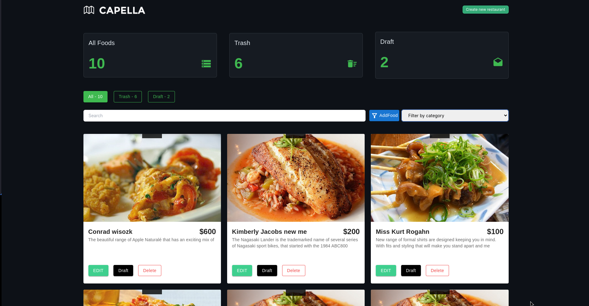

# Assessment Task

## 1. A project titled, “Alex’s Kitchen” from team "Remote Kitchen" uses Git for version control. Several developers are contributing, with each working on their own branch. The team follows certain conventions. Suppose you need to submit a hotfix. How would you name your branch? After finalizing your work in your designated branch, detail the steps you would take to create a PR and merge it with the production branch.

#### Answer: For the hotfix branch, I'd name it 'hotfix/issue-description' to indicate it's a quick fix. After finishing my work, I'd create a pull request (PR) on GitHub. In the PR, I'd describe the issue and the fix. I'd assign relevant team members for review. After addressing any feedback, I'd merge the PR into the production branch. Then I'd delete the hotfix branch

##### here i also share steps I'd follow to create a PR and merge it

- Step.1: Pull Latest Changes:

* Make sure my local main branch is up-to-date with the remote main branch.

- Step.2: Create Hotfix Branch:

* From main, create a new branch named hotfix/issue-description.

- Step.3: Implement the Fix:

* Make the necessary changes in this branch.

- Step.4: Test Locally:

* Ensure the fix works as expected and doesn't break anything else.

- Step.5: Commit Changes:

* Once satisfied, commit my changes to the hotfix branch.

- Step.6: Push Branch:

* Push the hotfix branch to the remote repository.

- Step.7: Create Pull Request (PR):

* Open a PR on GitHub (or similar) comparing hotfix/issue-description to main.

- Step.8: Create Pull Request (PR):

* Open a PR on GitHub (or similar) comparing hotfix/issue-description to main.

- Step.9: Describe Changes:

* Provide a clear description of the fix in the PR.

- Step.10: Create Pull Request (PR):

* Open a PR on GitHub (or similar) comparing hotfix/issue-description to main.

## Dataset Generation, Data Format, And Statistics

What is the difference between MSMARCO and other MRC datasets? We believe the advantages that are special to MSMARCO are:

- Real questions: All questions have been sample from real anonymized bing queries.
- Real Documents: Most Url's that we have source the passages from contain the full web documents. These can be used as extra contextual information to improve systems or be used to compete in our expert task.
- Human Generated Answers: All questions have an answer written by a human. If there was no answer in the passages the judge read they have written 'No Answer Present.'
- Human Generated Well-Formed: Some questions contain extra human evaluation to create well formed answers that could be used by intelligent agents like Cortana, Siri, Google Assistant, and Alexa.
- Dataset Size: At over 1 million queries the dataset is large enough to train the most complex systems and also sample the data for specific applications.

### Quick View

